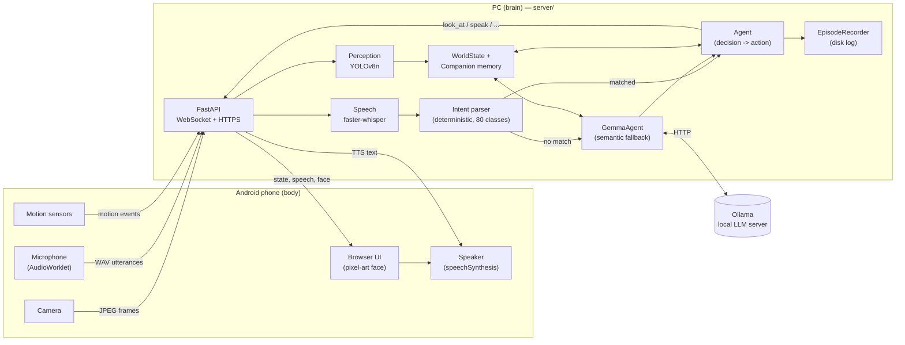

<!-- SPDX-FileCopyrightText: 2026 Luis Garbayo <lugarbayo@gmail.com> -->
<!-- SPDX-License-Identifier: MIT -->

# PeponBot

[](LICENSE)
<!-- Register the project and uncomment as each badge becomes available:
[](https://api.reuse.software/info/github.com/lgarbayo/pepon-bot)
[](https://www.bestpractices.dev/projects/<ID>)
[](https://scorecard.dev/viewer/?uri=github.com/lgarbayo/pepon-bot)
-->

A small desktop robot: an old Android phone is the body (camera, microphone, screen, speaker, motion sensors), a PC is the brain (FastAPI + YOLO + Whisper + a local LLM). No cloud service ever sees your camera or microphone — everything runs on your own network.

## What it solves

Turning a spare phone into a robot companion usually means either a cloud-dependent app (your camera feed leaves your house) or a from-scratch embedded project. PeponBot is neither: it's a thin, inspectable FastAPI backend that treats the phone's browser as a sensor/actuator pair over WebSocket + HTTPS, and does all reasoning — object detection, speech-to-text, semantic understanding — locally on whatever PC (ideally with a GPU) is on the same network.

## Features

- **Perception**: live camera feed from the phone, YOLOv8n object detection across all 80 COCO classes, person tracking, motion sensing (shake / pick-up / stability) from the phone's accelerometer.
- **Face**: 7 expression states (idle, listening, thinking, searching, found, confused, surprised) rendered as monochrome pixel art.
- **Voice**: fully local speech-to-text via Whisper (`faster-whisper`, GPU-accelerated) — no dependency on any single browser's speech API. One button starts a continuous, hands-free conversation; it ends each phrase on silence, not on a manual stop.
- **Understanding**: a fast deterministic parser handles common questions instantly ("what do you see?", "where's the cup?", "find the bottle") across the full 80-class vocabulary in Spanish; anything else falls back to a local LLM (Gemma 3, via Ollama) for grounded semantic reasoning — including reading the camera frame when the question needs it.
- **Memory**: short-term WorldState (what's visible now vs. what was last seen and when) and a persistent companion layer — up to 24h of visual memory, confirmed scene-change detection, one-shot watches ("tell me when the mug is back"), quiet/sociable personality modes.
- **Diagnostics**: `/api/health`, and a `/debug` page with a live camera feed, detections, world state, and the last voice transcript/error.

Deliberately out of scope: PeponBot answers questions about what it perceives, not general trivia — see [Conversation scope](#conversation-scope) below.

## Architecture



Perception, speech-to-text and the deterministic parser never call the LLM — Gemma is only consulted once per voice command, and only when nothing else could answer it.

## Installation

Requirements:

- Python 3.11+ (developed and tested on 3.13)
- Node.js 18+ (only needed to run the JS test suite — the app itself ships zero build step, plain `static/*.js`)
- [Ollama](https://ollama.com) running locally, with a Gemma 3 model pulled (e.g. `ollama pull gemma3:4b`, or `ollama pull hf.co/unsloth/gemma-3-4b-it-GGUF:Q4_K_M` if Ollama's own registry is blocked on your network — see [Troubleshooting](#troubleshooting))
- An NVIDIA GPU is strongly recommended for real-time detection + transcription, but `faster-whisper` and YOLOv8n both fall back to CPU

```sh
git clone git@github.com:lgarbayo/pepon-bot.git
cd pepon-bot
python3 -m venv .venv && source .venv/bin/activate
pip install -r requirements.txt

# In one terminal, if Ollama isn't already running:
ollama serve

# In another terminal:
cd server
python3 main.py
```

Open `https://<your-PC's-LAN-IP>:8000` on the phone's browser and accept the warning for the locally-generated, self-signed certificate (it's generated on first run under `certs/`, gitignored, unique to your machine). `/debug` on the PC shows camera, memory, voice and companion state for diagnostics. The first tap on the phone unlocks the browser's audio (a platform restriction, not something PeponBot can skip).

## Usage examples

| Feature | What you can say |
| --- | --- |
| Perception | "What do you see?", "Do you see a bottle?", "Find the book", "Look at me" |
| Cross-turn references | "Do you see a bottle?" → "Where is it?" → "Tell me when it disappears" |
| Visual memory | "Where did you last see my cup?" |
| Changes | "What's changed on the table?" |
| Watches | "Tell me when someone appears", "Watch for the cup coming back" |
| Return reminders | "Remind me to drink water when I get back" |
| Management | "What are you keeping an eye on", "Cancel the cup watches", "Cancel all watches" |
| Personality | "Quiet mode", "Sociable mode" |

The parser covers all **80 COCO classes**, their Spanish names and synonyms. Gemma receives up to 12 recent turns and the current visual state for other questions. The referent expires after five minutes of inactivity and resets when a new session starts.

Tap the orb to talk: each phrase ends after roughly 700ms of silence — no need to tap again to send it. You can interrupt a reply by talking over it. Tap the orb again to end the conversation and release the microphone. The `PEPÓN` menu lets you toggle quiet mode and view/cancel watches.

## Conversation scope

Gemma is deliberately scoped to what Pepón perceives, not open-ended chit-chat. Its system prompt frames it as "the semantic reasoning module of Pepón" and requires every claim to be grounded in `visible_objects`/`memory`, with short, one-sentence answers. Tested directly against the running server:

| You say | Pepón answers |
| --- | --- |
| "¿Cómo estás?" (How are you?) | "Estoy bien, gracias por preguntar." — small talk works |
| "Cuéntame un chiste" (Tell me a joke) | "Lo siento, no puedo contar chistes en este momento." — declines |
| "¿Cuál es la capital de Francia?" (What's the capital of France?) | "Lo siento, no puedo responder preguntas sobre capitales de países." — declines |

This is a deliberate trade-off, not a bug: it keeps Pepón focused on being useful about the room instead of drifting into general trivia. Widening the system prompt to allow general conversation would be a small, deliberate change — intentionally left as-is for this project.

## Memory, watches and personality

- Visual memory retains up to 24 hours of recent observations, with side and age. On restart it's restored strictly as **past** observation, never as current visibility. A single stray detection is never treated as fact — see [`ARCHITECTURE_DECISIONS.md`](docs/ARCHITECTURE_DECISIONS.md).
- Changes are confirmed over at least one second and three distinct detection frames, describing class and frame-position changes over the last minute.
- A stale camera, disconnect, camera switch or picking up the phone all reset the comparison; none of these are treated as objects having disappeared.
- Up to 32 one-shot watches for appearance, disappearance or return, persisted to disk and cancellable.
- In sociable mode it can greet you after an observed absence of at least 30 seconds and comment on being picked up — no more than once every two minutes, and never mid-turn.
- It doesn't identify individual people or localize voices by direction: the mono microphone can't reliably attribute who's speaking in a group.
- Memory and watches live in `data/companion.json` (gitignored, atomic writes, saved roughly every 10s and on shutdown). Every interaction is logged to `data/episodes/`.

## Configuration

All environment variables are optional; sane defaults are in `server/config.py`.

| Variable | Default | Meaning |
| --- | --- | --- |
| `GEMMA_ENABLED` | `true` | Set to `false` to disable the LLM fallback entirely (deterministic-only mode). |
| `OLLAMA_BASE_URL` | `http://localhost:11434` | Where Ollama's HTTP API is listening. |
| `OLLAMA_MODEL` | `hf.co/unsloth/gemma-3-4b-it-GGUF:Q4_K_M` | The Ollama model tag to use for semantic reasoning. |
| `GEMMA_TIMEOUT_SECONDS` | `20` | Per-request timeout for a single Ollama call. |
| `GEMMA_TOTAL_TIMEOUT_SECONDS` | `35` | Total budget for a semantic decision, including the one retry on malformed output. |
| `GEMMA_DEBUG` | `false` | Log the full compact WorldState sent to Gemma on every call. |
| `WHISPER_MODEL` | `small` | `faster-whisper` model size. |
| `WHISPER_LANGUAGE` | `es` | Transcription language hint. |

## Compatibility

| Component | Tested on |
| --- | --- |
| Backend | Python 3.13, Linux, NVIDIA GPU (CUDA 12 runtime via `nvidia-cublas-cu12`/`nvidia-cudnn-cu12`) and CPU fallback |
| Phone browser | Chrome on Android (real device). Voice capture uses `getUserMedia` + `AudioWorklet`, not any single browser's speech-recognition API, so any modern browser supporting those should work — not yet verified on iOS Safari or desktop Firefox |
| Browser test suite | Chromium via Playwright (`static/tests/browser_checks.py`) |

## Troubleshooting

- **`gemma: unavailable` in `/api/health`**: Ollama isn't running. Start it with `ollama serve` in another terminal.
- **`RuntimeError: Library libcublas.so.12 is not found or cannot be loaded`**: `faster-whisper`'s CUDA path needs the CUDA 12 ABI specifically; install `nvidia-cublas-cu12` and `nvidia-cudnn-cu12` (already pinned in `requirements.txt`) even if newer `nvidia-cublas`/CUDA 13 packages are already present for something else.
- **`ollama pull gemma3:4b` times out / hangs downloading**: some networks block Ollama's default blob host (Cloudflare R2). Try the HuggingFace passthrough instead: `ollama pull hf.co/unsloth/gemma-3-4b-it-GGUF:Q4_K_M`, and set `OLLAMA_MODEL` to match.
- **A Gemma-backed answer references an object that clearly isn't in the room**: should not happen — WorldState only shares a class with Gemma once it's been confirmed across several consecutive detection frames (see `docs/ARCHITECTURE_DECISIONS.md`). If it still happens, please open an issue with the transcript and `/debug` output.
- **`address already in use` on port 8000**: another PeponBot instance (yours or a previous run) is already listening; the server refuses to start a second copy rather than double-loading models onto the GPU.
- **The phone won't play audio at all**: browsers only allow `speechSynthesis` after a real tap; the first tap on the talk button both starts the conversation and unlocks audio.

## Diagnostics

- `GET /api/health` — status of local services.
- `GET /api/world` — memory, camera freshness and confirmed changes.
- `GET /api/voice/status` — transcript, errors, session state and the last semantic query's outcome.
- `GET /api/assistant` — preferences, watches and pending notifications.
- `POST /api/assistant/preferences` — `{"quiet": true}`.
- `DELETE /api/assistant/watches/{id}` — cancel a watch.
- `POST /api/assistant/notifications/{id}/ack` — acknowledge a notification.

```sh
python3 -m pytest server/tests -q
node static/tests/voice-vad.test.cjs
python3 static/tests/browser_checks.py   # needs Playwright + Chromium
```

## Support

- Bugs and feature requests: [GitHub Issues](https://github.com/lgarbayo/pepon-bot/issues) (templates provided).
- Security vulnerabilities: see [`SECURITY.md`](SECURITY.md) — please do **not** open a public issue.
- Contributing: see [`CONTRIBUTING.md`](CONTRIBUTING.md).
- Design history and trade-offs: see [`docs/ARCHITECTURE_DECISIONS.md`](docs/ARCHITECTURE_DECISIONS.md).

This project ships **without warranties of any kind** (see [`LICENSE`](LICENSE)) and was built as a fast personal project, not a production system.
